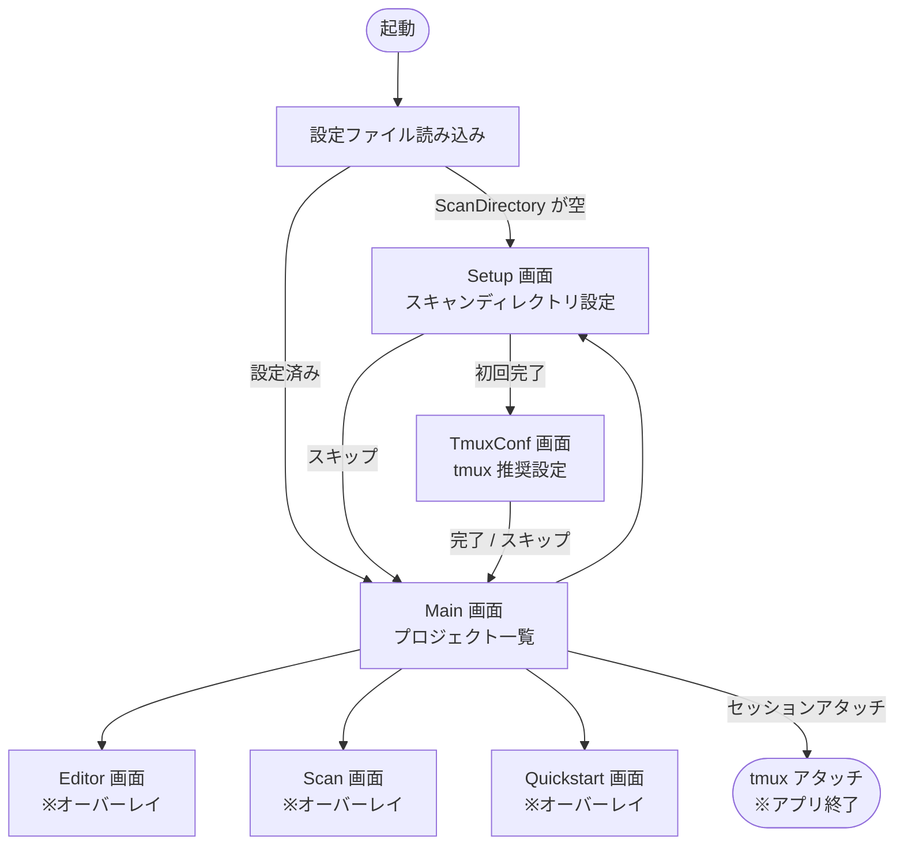
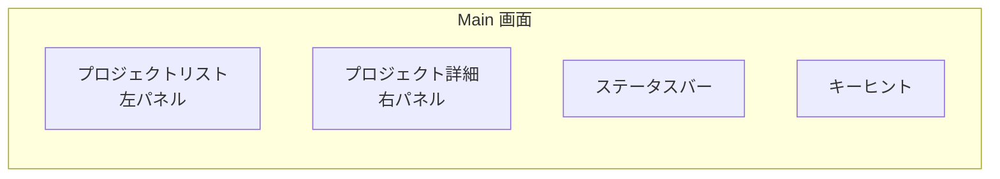
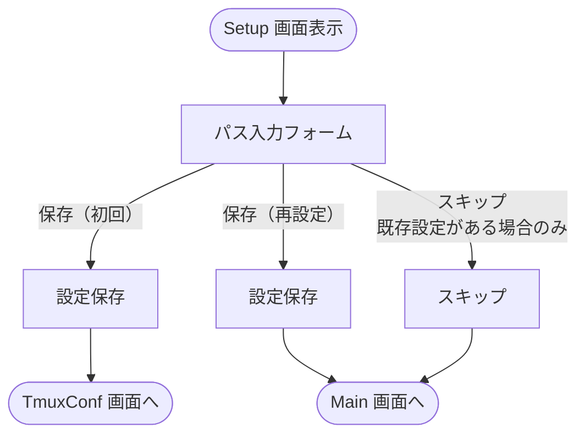
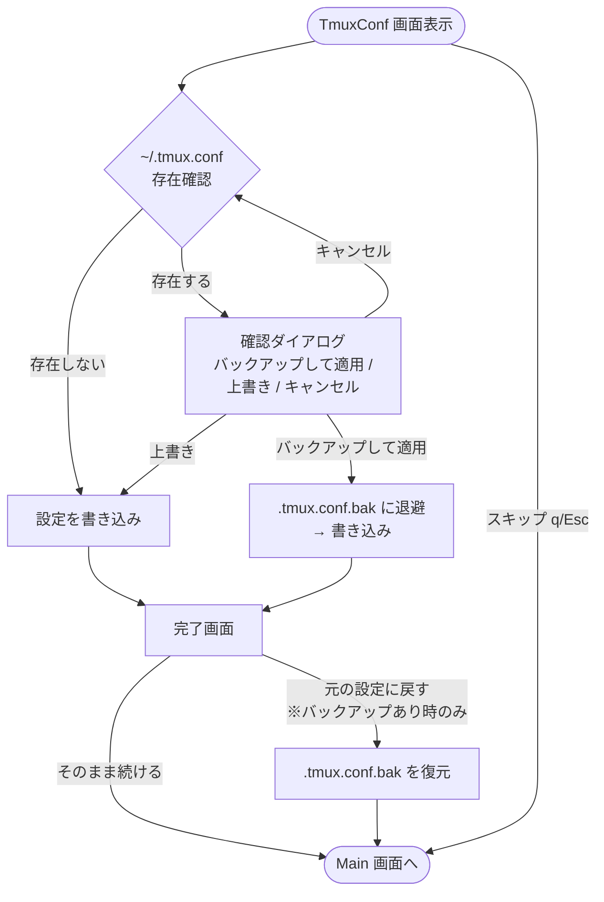
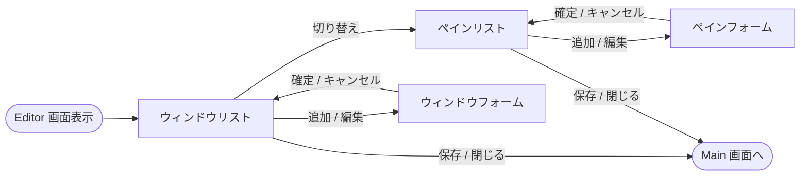
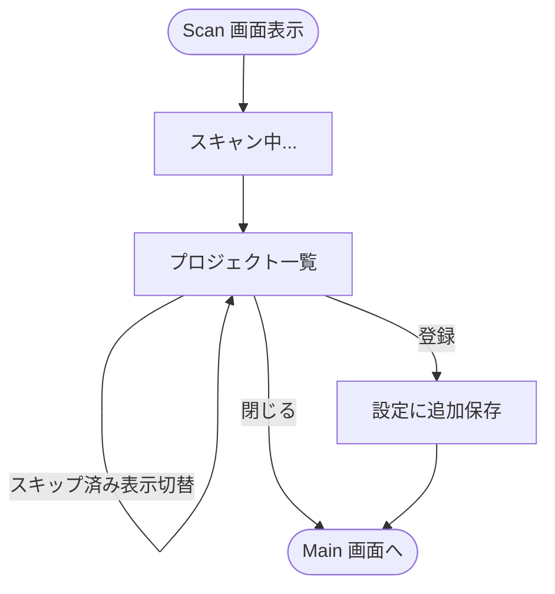
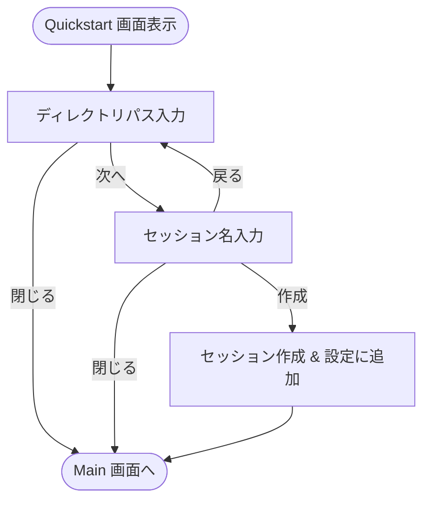
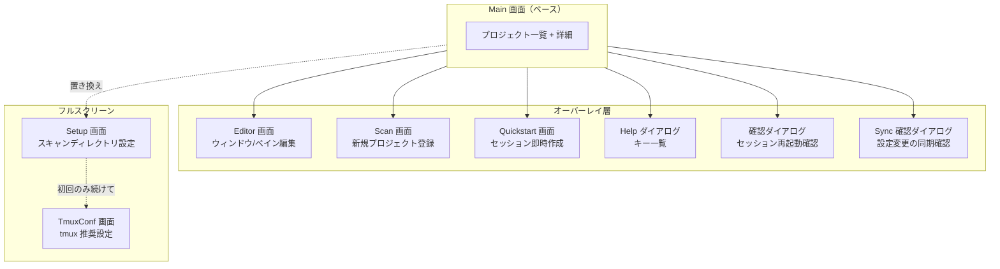
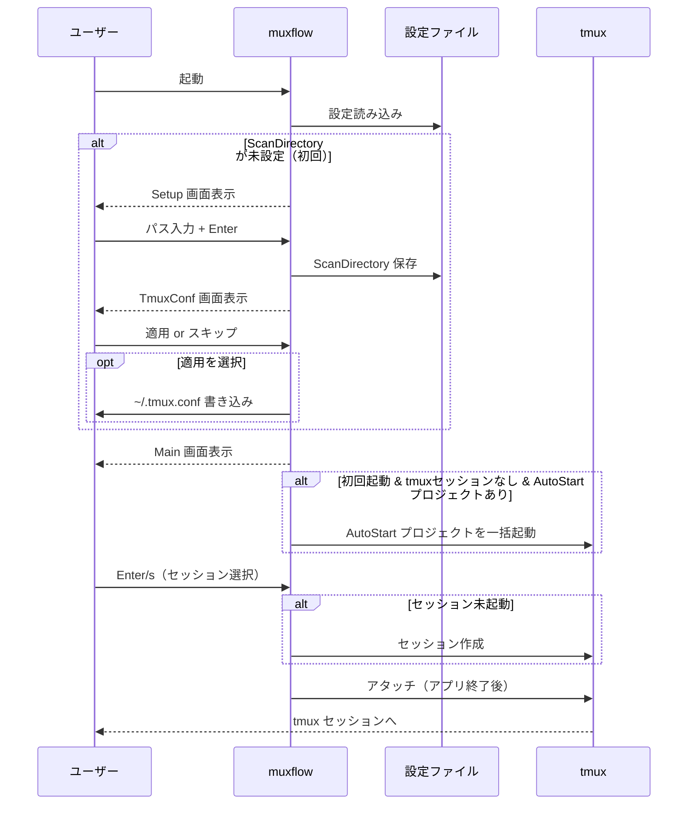

# muxflow 画面フロー図

## 全体画面遷移

オーバーレイ画面（Editor / Scan / Quickstart）は閉じると常に Main に戻る。

---

## Main 画面

プロジェクト一覧と詳細を表示するメイン画面。

---

## Setup 画面（フルスクリーン）

初回起動時または `S` キーで表示。スキャンディレクトリのパスを入力する。

**表示条件:**
- 初回起動時（`ScanDirectory` が空）→ 自動遷移（完了後 TmuxConf 画面へ）
- Main 画面で `S` キー押下（完了後 Main 画面へ）

---

## TmuxConf 画面（フルスクリーン）

初回セットアップ完了後のみ表示。ツール制作者推奨の `~/.tmux.conf` を適用できる。

**表示条件:**
- 初回セットアップ（`ScanDirectory` が空の状態での Setup 完了）直後のみ自動遷移

---

## Editor 画面（オーバーレイ）

Main 画面の上に重なって表示される。プロジェクトのウィンドウ・ペイン構成を編集する。

ウィンドウリストとペインリストは Tab で相互に切り替え可能。

---

## Scan 画面（オーバーレイ）

Main 画面の上に重なって表示される。スキャンディレクトリ配下の未登録プロジェクトを一覧表示し、登録するプロジェクトを選択する。

---

## Quickstart 画面（オーバーレイ）

Main 画面の上に重なって表示される。任意ディレクトリを指定して即座にtmuxセッションを作成する。

---

## オーバーレイ一覧

> **オーバーレイ**: Main 画面がバックグラウンドに透けて見える状態でダイアログが前面表示される
>
> **フルスクリーン**: Main 画面を完全に置き換えて表示される（Setup / TmuxConf）

---

## 起動フロー

